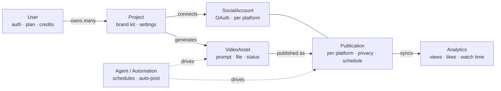

# Admart — Backend Architecture

> Status: living document
> Audience: backend + frontend team
> Companion specs: `backend-project-onboarding.md`, `backend-social-accounts.md`, `frontend-integration.md`

## 1. What this platform is

Admart is an **agentic social-media platform**. A user can:

1. **Create** short-form videos (AI generation via a third-party video/image generation API).
2. **Publish** them to their connected social accounts (YouTube first; TikTok, Instagram, Facebook later).
3. **Track analytics** for what they posted (views, likes, watch time, …).
4. Have an **agent** automate the loop (generate → post → react to performance) over time.

Everything is organized under a **Project**: a workspace with its own brand kit, connected
accounts, content, and analytics. A user owns many projects (one per brand / set of accounts).

## 2. Domain model



### Entities

| Entity | Belongs to | Purpose | Status |
| ------ | ---------- | ------- | ------ |
| **User** | — | Identity, auth (JWT + Google), plan, credits, `active_project` | ✅ Implemented |
| **Project** | User (`owner`) | Workspace + brand kit + per-project settings; parent of everything below | ✅ Implemented |
| **SocialAccount** | Project | OAuth connection to one platform; encrypted tokens; profile | 🔨 In progress (YouTube) |
| **VideoAsset** | Project | A generated short video: prompt, generation job status, output file/URL, duration | ⬜ Planned |
| **Publication** | VideoAsset + SocialAccount | One video posted to one account: platform `videoId`, privacy, schedule, state | ⬜ Planned |
| **Analytics** | Publication | Per-publication metrics synced from the provider | ⬜ Planned |
| **Automation/Agent** | Project | Scheduled / rule-based "generate + post" workflows | ⬜ Later |

### Key rules

- **Project is the parent boundary.** Social accounts, videos, publications, and analytics are
  all scoped to a project. Switching the active project switches the entire working context.
- **Active project** is stored on the `User` (`active_project`, `SET_NULL`) so the selection
  survives logout/login; the API falls back to most-recently-accessed when unset.
- **Single-owner today**, designed for **sharing later**: a future `ProjectMember`
  (user + project + role) through-model replaces the `owner=user` filters with membership
  checks — no change to the core models.
- **Credits** (on `User`) are consumed by video generation.

## 3. Service boundaries (bounded contexts)

| Context | Responsibility | Depends on | Status |
| ------- | -------------- | ---------- | ------ |
| **Identity & Workspace** | Users, auth, projects, brand kit, active project | — | ✅ |
| **Connections** | Social OAuth, encrypted token storage, refresh | Identity | 🔨 |
| **Content / Generation** | Create videos via an external generation API, async job lifecycle, credit spend | Identity | ⬜ |
| **Publishing** | Upload/schedule a video to a SocialAccount | Connections, Content | ⬜ |
| **Analytics** | Pull & aggregate per-publication metrics from providers | Publishing | ⬜ |
| **Agent / Orchestration** | Automated generate→post→learn workflows | all above | ⬜ |

Build order follows the dependency arrows: **Connections → Publishing → Analytics → Agent.**

## 4. App layout (Django)

```
config/      # settings, root urls, ASGI/WSGI
users/       # User model, auth, onboarding   (Identity & Workspace)
projects/    # Project + SocialAccount + OAuth (Workspace + Connections)
             # → future: videos/, publishing/, analytics/ apps or modules
```

> New bounded contexts (Content, Publishing, Analytics) will become their own apps/modules as
> they're built, each owning its models and migrations, all referencing `projects.Project`.

## 5. Cross-cutting concerns

- **Auth:** JWT (`rest_framework_simplejwt`) on every endpoint except the OAuth provider
  callback (secured by a signed `state`). Google sign-in is separate from social *connection*
  OAuth (different scopes + redirect URI).
- **Authorization:** every query is scoped by `owner=request.user`; cross-user access returns
  `404` (never leak existence).
- **Secrets at rest:** social `accessToken`/`refreshToken` are **encrypted** (Fernet) and never
  returned by any serializer. OAuth `state` is signed and time-limited (CSRF).
- **Async/long-running work:** video generation and (later) analytics sync are background jobs
  (poll/queue), not request-blocking. Generation is delegated to a **third-party generation API**
  (provider config in env); the backend submits a job, polls for completion, and stores the
  resulting video asset.
- **Observability:** structured logging with correlation per request; provider/API failures are
  logged and surfaced as `502` to the client.
- **API style:** REST, JSON, camelCase payloads, ISO-8601 timestamps, OpenAPI via
  `drf-spectacular` (`/api/schema`, `/api/docs`).

## 6. Platform integration notes

- **YouTube (first):** Google OAuth (`youtube.readonly` + `youtube.upload`). The upload scope
  unlocks both publishing (`videos.insert`) and analytics reads (`videos.list` statistics), so
  one connection covers the whole lifecycle.
  - ⚠️ **App audit:** until the Google project passes the YouTube API Services audit, API
    uploads are **force-locked to private** — a launch blocker, not a dev blocker.
  - ⚠️ **Quota:** ~10,000 units/day, ~1,600 per upload (~6/day) until a quota increase is granted.
- **Facebook + Instagram (Meta):** a **single Meta app** powers both via Facebook Login —
  connect flow implemented (`MetaProvider`/`InstagramProvider`). They share `META_APP_ID`/
  `META_APP_SECRET`, differing only in scopes, redirect URI, and profile lookup (IG resolves the
  Business account linked to a Page). Publishing scopes need Meta App Review for production.
- **TikTok:** not yet implemented; its connect call returns `501` so the UI can disable it.

## 7. Current API surface (implemented)

- **Auth:** `POST /api/auth/{register,login,refresh,logout,google,forgot-password,reset-password}`,
  `GET/PATCH /api/auth/me`, `POST /api/auth/onboarding/complete`.
- **Projects:** `GET/POST /api/projects`, `GET/PATCH/DELETE /api/projects/:id`,
  `POST /api/projects/:id/activate`.
- **Social (per project):** `GET /api/projects/:id/social/accounts`,
  `POST /api/projects/:id/social/connect/:platform` (mock),
  `DELETE /api/projects/:id/social/disconnect/:platform`.
  - 🔨 Being added: `GET …/social/connect/:platform/url` + `GET /api/social/callback/:platform`
    (real OAuth), and later `POST …/social/youtube/upload`.
