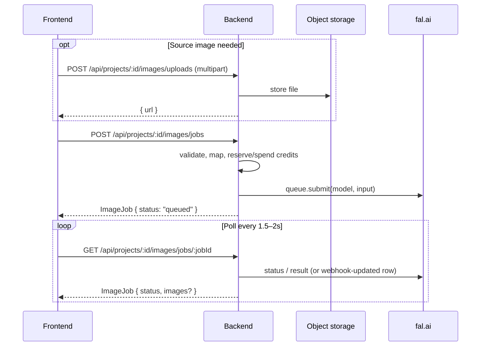

# Backend Spec — Image Generation & Editing (fal.ai)

> Status: **proposed**  
> Audience: backend team  
> Provider: **fal.ai** (`FAL_KEY` server-side only — never expose to the browser)  
> Companion docs: `frontend-image-generation.md`, `frontend-integration.md`  
> Related frontend: `src/pages/ImageGenPage.jsx`, `src/utils/imageGeneration.js`

---

## 1. Overview

Admart image tools are **capabilities**, not raw fal model IDs. The frontend sends a unified
camelCase job payload; the backend validates, maps fields to fal’s snake_case input, spends
credits, submits to fal, and exposes an async job the client polls.

| Capability (API value) | User intent | Typical fal model(s) |
| ---------------------- | ----------- | -------------------- |
| `textToImage` | Prompt → new image | `fal-ai/flux/dev`, `fal-ai/nano-banana-2`, `fal-ai/ideogram/v3` |
| `edit` | Prompt + 1 image → edited image | `fal-ai/nano-banana-2/edit`, `fal-ai/flux-pro/kontext` |
| `multiEdit` | Prompt + 2+ images → compose / transfer | `fal-ai/nano-banana-pro/edit` |
| `upscale` | Image → higher resolution | `fal-ai/esrgan`, `fal-ai/seedvr/upscale/image` |
| `removeBackground` | Image → transparent PNG | `fal-ai/birefnet/v2`, `fal-ai/bria/background/remove` |

### Rules for backend

1. Hold `FAL_KEY` only in server env. Never return it; never accept it from the client.
2. Accept **camelCase** from FE; map to fal **snake_case** + model-specific shapes.
3. Jobs are **async**: create → `queued` / `running` → `succeeded` | `failed`.
4. Scope every job and upload to a **project** the authenticated user owns.
5. Prefer **HTTPS URLs** for source images (upload endpoint). Do not require multi‑MB base64 on create-job.



---

## 2. Data model

### 2.1 `ImageJob`

One row (or document) per generation request.

| Field | Type | Notes |
| ----- | ---- | ----- |
| `id` | string (uuid) | Primary key / `jobId` returned to FE |
| `projectId` | string (uuid) | FK → project |
| `userId` | string (uuid) | Who submitted (audit) |
| `capability` | enum | `textToImage` \| `edit` \| `multiEdit` \| `upscale` \| `removeBackground` |
| `model` | string | fal model id actually used |
| `status` | enum | `queued` \| `running` \| `succeeded` \| `failed` |
| `prompt` | string \| null | Stored for history / UI |
| `request` | json | Sanitized create payload (no secrets) |
| `images` | json array | `ImageAsset[]` — empty until succeeded |
| `maskImage` | json \| null | Optional rembg mask asset |
| `error` | string \| null | Safe message for FE when `failed` |
| `creditsUsed` | decimal \| null | Set when job succeeds (or on submit if you debit up-front) |
| `seed` | int \| null | Echo fal seed when available |
| `falRequestId` | string \| null | fal queue / request id for debugging |
| `createdAt` | datetime | ISO-8601 |
| `updatedAt` | datetime | ISO-8601 |

**Never return to FE:** raw fal API keys, internal stack traces, storage credentials.

### 2.2 `ImageAsset` (embedded in job response)

```json
{
  "url": "https://cdn.example.com/projects/…/out.png",
  "width": 1024,
  "height": 1024,
  "contentType": "image/png",
  "fileName": "admart-textToImage-1.png"
}
```

Prefer **your own CDN / signed URLs** after copying fal result URLs into durable storage.
fal result URLs may be temporary — do not rely on them as permanent library assets.

### 2.3 Uploads (source images)

Track uploads if you need GC / quota:

| Field | Type | Notes |
| ----- | ---- | ----- |
| `id` | uuid | |
| `projectId` | uuid | |
| `userId` | uuid | |
| `url` | string | Public HTTPS URL fal can fetch |
| `contentType` | string | `image/jpeg` \| `image/png` \| `image/webp` |
| `byteSize` | int | |
| `createdAt` | datetime | |

---

## 3. Endpoints

All require `Authorization: Bearer <accessToken>` unless noted.  
`:id` / `:projectId` = project UUID; return **404** if not owned by the user (no existence leak).

### 3.1 Create job

```
POST /api/projects/:projectId/images/jobs
Content-Type: application/json
```

**Request body** — unified create shape (see `frontend-image-generation.md` §2.1):

```json
{
  "capability": "textToImage",
  "model": "fal-ai/flux/dev",
  "prompt": "Product shot of a matte black water bottle on marble, soft studio light",
  "aspectRatio": "1:1",
  "numImages": 1,
  "outputFormat": "png"
}
```

**Success `202` or `200`:**

```json
{
  "id": "8f3c2a1e-…",
  "projectId": "5f1c0c2e-…",
  "capability": "textToImage",
  "model": "fal-ai/flux/dev",
  "status": "queued",
  "prompt": "Product shot of a matte black water bottle…",
  "images": [],
  "maskImage": null,
  "error": null,
  "creditsUsed": null,
  "seed": null,
  "createdAt": "2026-07-18T11:00:00Z",
  "updatedAt": "2026-07-18T11:00:00Z"
}
```

**Server steps**

1. Auth + project ownership.
2. Validate capability + required fields (§5).
3. Resolve `model` (request or default for capability).
4. Whitelist model against allow-list for that capability (§6).
5. Map camelCase → fal input (§7).
6. Check credits; reject with `402` if insufficient.
7. Persist `ImageJob` (`queued`), submit to fal (`fal_client.subscribe` / queue API).
8. Return job immediately; update status asynchronously (worker, webhook, or poll-on-read).

### 3.2 Get job (poll)

```
GET /api/projects/:projectId/images/jobs/:jobId
```

`200` → full `ImageJob` public shape.  
FE polls every **1.5–2s**, stops on `succeeded` | `failed`, gives up after ~3–5 minutes.

On read, if status is still open and you don’t use webhooks, optionally refresh from fal and
persist before responding.

### 3.3 List jobs (optional, recommended)

```
GET /api/projects/:projectId/images/jobs?limit=20&cursor=…
```

`200` → `{ "items": ImageJob[], "nextCursor": "…" }`  
Newest first. Used for session history / library later.

### 3.4 Upload source image

```
POST /api/projects/:projectId/images/uploads
Content-Type: multipart/form-data
```

Field name: `file` (single).  

**Accept:** `image/jpeg`, `image/png`, `image/webp`  
**Max size:** suggest **10–15 MB** (align with FE soft limit).

`201`:

```json
{
  "url": "https://cdn.example.com/projects/5f1c…/uploads/abc.png",
  "contentType": "image/png",
  "byteSize": 245760
}
```

FE passes `url` in `imageUrls[]` on create-job. fal must be able to **HTTP GET** that URL
(public or short-lived signed URL with enough TTL).

### 3.5 Model catalog (optional)

```
GET /api/images/models
```

or project-scoped:

```
GET /api/projects/:projectId/images/models
```

`200` — list models per capability so FE can stop hardcoding:

```json
{
  "textToImage": [
    { "id": "fal-ai/flux/dev", "label": "Flux Dev", "family": "flux", "default": true }
  ],
  "edit": [ … ],
  "multiEdit": [ … ],
  "upscale": [ … ],
  "removeBackground": [ … ]
}
```

Until this ships, FE uses the static lists in `src/utils/imageGeneration.js`.

### 3.6 Cancel job (optional)

```
POST /api/projects/:projectId/images/jobs/:jobId/cancel
```

Best-effort cancel on fal if still queued; set status `failed` with `error: "Cancelled"`.  
Refund credits only if you debit on submit and fal never started.

---

## 4. Capability validation

| Capability | Block create if |
| ---------- | --------------- |
| `textToImage` | `prompt` empty / whitespace |
| `edit` | no `prompt` **or** missing `imageUrls[0]` |
| `multiEdit` | no `prompt` **or** `imageUrls.length < 2` |
| `upscale` | missing `imageUrls[0]` |
| `removeBackground` | missing `imageUrls[0]` |

Also enforce:

| Rule | Value |
| ---- | ----- |
| Max prompt length | ~2000 chars |
| `numImages` | 1–4 (default 1) |
| Multi-edit uploads | 2–6 URLs |
| `imageUrls` entries | HTTPS URLs only (your CDN or allow-listed hosts) |
| MIME (uploads) | jpeg / png / webp |

Return `400` with a clear `message` (and optional `field`) when validation fails.

---

## 5. Defaults

| Capability | Default model | Notes |
| ---------- | ------------- | ----- |
| `textToImage` | `fal-ai/flux/dev` | Product may switch to `nano-banana-2` |
| `edit` | `fal-ai/nano-banana-2/edit` | |
| `multiEdit` | `fal-ai/nano-banana-pro/edit` | |
| `upscale` | `fal-ai/esrgan` | |
| `removeBackground` | `fal-ai/birefnet/v2` | Prefer `output_format=png` |

If client omits `model`, apply the default. If client sends an unknown / disallowed model → `400`.

---

## 6. Model allow-lists

### 6.1 Text to image

| Label | Model id | Family |
| ----- | -------- | ------ |
| Flux Dev | `fal-ai/flux/dev` | flux |
| Flux Schnell | `fal-ai/flux/schnell` | flux |
| Nano Banana 2 | `fal-ai/nano-banana-2` | nano |
| Nano Banana Pro | `fal-ai/nano-banana-pro` | nano |
| Ideogram V3 | `fal-ai/ideogram/v3` | ideogram |
| GPT Image 2 | `openai/gpt-image-2` | openai (not `fal-ai/openai/…`) |

### 6.2 Edit / multi-edit

| Label | Model id | Multi-image |
| ----- | -------- | ----------- |
| Nano Banana 2 Edit | `fal-ai/nano-banana-2/edit` | yes |
| Nano Banana Pro Edit | `fal-ai/nano-banana-pro/edit` | yes (recommended) |
| Flux Kontext Pro | `fal-ai/flux-pro/kontext` | typically single |
| GPT Image 2 Edit | `openai/gpt-image-2/edit` | yes — **must be on BE allow-list** |

> **Frontend note:** Error `"Model not allowed for edit: openai/gpt-image-2/edit"` means the
> **backend whitelist rejected the id**, not fal. The model is live at
> [openai/gpt-image-2/edit](https://fal.ai/models/openai/gpt-image-2/edit). Add this exact
> string to the edit / multiEdit allow-list (same for `openai/gpt-image-2` on textToImage).
> Until then, FE hides GPT Image Edit from the picker.

### 6.3 Upscale

| Label | Model id |
| ----- | -------- |
| ESRGAN | `fal-ai/esrgan` |
| SeedVR2 | `fal-ai/seedvr/upscale/image` |
| Topaz | `fal-ai/topaz/upscale/image` |
| Recraft Crisp | `fal-ai/recraft/upscale/crisp` |
| Ideogram Upscale | `fal-ai/ideogram/upscale` |

> Confirm partner ids in the fal dashboard — GPT Image uses `openai/gpt-image-2`, not `fal-ai/openai/gpt-image-2`.

### 6.4 Remove background

| Label | Model id |
| ----- | -------- |
| BiRefNet v2 | `fal-ai/birefnet/v2` |
| BiRefNet | `fal-ai/birefnet` |
| Bria RMBG 2.0 | `fal-ai/bria/background/remove` |

> Confirm partner model ids in the [fal dashboard](https://fal.ai/explore/models) before
> production — fal renames partner endpoints occasionally.

---

## 7. Field mapping (camelCase → fal)

| Our field | fal field | Notes |
| --------- | --------- | ----- |
| `prompt` | `prompt` | |
| `negativePrompt` | `negative_prompt` | Ideogram / some Flux |
| `imageUrls` | `image_urls` or `image_url` | Singular tools take one URL |
| `aspectRatio` | `aspect_ratio` | Nano Banana: pass through |
| `imageSize` | `image_size` | Flux enums / custom size |
| `numImages` | `num_images` | |
| `numInferenceSteps` | `num_inference_steps` | Flux |
| `guidanceScale` | `guidance_scale` | Flux |
| `outputFormat` | `output_format` | |
| `enableSafetyChecker` | `enable_safety_checker` | Keep default on for consumer UI |
| `systemPrompt` | `system_prompt` | Nano |
| `enableWebSearch` | `enable_web_search` | Nano Banana 2 |
| `thinkingLevel` | `thinking_level` | Nano Banana 2 |
| `expandPrompt` | `expand_prompt` | Ideogram |
| `renderingSpeed` | `rendering_speed` | Ideogram |
| `faceEnhance` | `face` | ESRGAN |
| `operatingResolution` | `operating_resolution` | BiRefNet |
| `outputMask` | `output_mask` | BiRefNet |
| `refineForeground` | `refine_foreground` | BiRefNet |
| `rembgModel` | model-specific | Map `light` / `heavy` / `portrait` per BiRefNet docs |
| `scale` | `scale` | Upscale |
| `resolution` | `resolution` | Nano `0.5K`–`4K` |
| `style` | `style` | Ideogram |
| `stylePreset` | `style_preset` | Ideogram |

### 7.1 Aspect ratio → Flux `image_size`

FE prefers one UX control: `aspectRatio`. For Flux family models, map:

| UI `aspectRatio` | Flux `image_size` |
| ---------------- | ----------------- |
| `1:1` | `square_hd` |
| `16:9` | `landscape_16_9` |
| `9:16` | `portrait_16_9` |
| `4:3` | `landscape_4_3` |
| `3:4` | `portrait_4_3` |
| `auto` | omit / model default |

If client already sends `imageSize`, prefer that over mapping from `aspectRatio`.

### 7.2 Example mapped inputs

**Flux text-to-image**

```json
{
  "prompt": "…",
  "image_size": "square_hd",
  "num_images": 1,
  "output_format": "png",
  "enable_safety_checker": true
}
```

**Nano Banana edit**

```json
{
  "prompt": "Replace the background with a soft beige studio backdrop",
  "image_urls": ["https://cdn.example.com/uploads/product.png"],
  "aspect_ratio": "auto",
  "resolution": "1K"
}
```

**ESRGAN upscale**

```json
{
  "image_url": "https://cdn.example.com/draft.png",
  "scale": 2,
  "face": true
}
```

**BiRefNet rembg**

```json
{
  "image_url": "https://cdn.example.com/product.jpg",
  "operating_resolution": "1024x1024",
  "output_format": "png",
  "output_mask": false,
  "refine_foreground": true
}
```

(Adjust exact BiRefNet field names to the current fal model schema.)

---

## 8. fal.ai integration

### 8.1 Env vars

| Variable | Purpose |
| -------- | ------- |
| `FAL_KEY` | fal API key (**secret**) |
| `FAL_WEBHOOK_SECRET` | Optional — verify fal webhooks |
| `MEDIA_BUCKET` / CDN creds | Durable storage for uploads + results |
| `FRONTEND_URL` | Not required for jobs; useful for absolute links in emails later |

### 8.2 Submit patterns

Use the official fal client (Python / Node) for the Django/Node stack you run:

- **Queue + poll:** `submit` → store `falRequestId` → worker or on-GET sync status.
- **Subscribe (sync wait):** acceptable only inside a background worker — **never** block the HTTP request for the full generation.

Recommended: HTTP create returns immediately; a Celery / RQ / Dramatiq / Cloud Task worker drives fal to completion and writes `images` + `status`.

### 8.3 Result persistence

1. fal returns temporary `images[].url`.
2. Backend downloads → uploads to your bucket under `projects/{projectId}/images/{jobId}/…`.
3. Persist durable URLs on `ImageJob.images`.
4. Optionally enqueue library / brand-kit attachment later.

### 8.4 Webhooks (optional)

If fal supports result webhooks for your plan, expose:

```
POST /api/webhooks/fal/images
```

Verify signature with `FAL_WEBHOOK_SECRET`, match `falRequestId` → job, update status/images.
Still keep poll-on-GET as a fallback.

---

## 9. Credits

Credits are the gateway for AI usage (same system as video).

| Guideline | Suggestion |
| --------- | ---------- |
| Debit timing | Reserve on create; finalize on `succeeded`; refund on `failed` / cancel-before-start |
| Insufficient balance | `402` `{ "message": "Insufficient credits", "code": "INSUFFICIENT_CREDITS", "creditsRemaining": 0, "creditsTotal": 5 }` |
| Balance field | Always gate Generate on **`creditsRemaining`**, never `creditsTotal` (total = plan allotment) |
| `creditsUsed` | Set on job when finalized; FE may show it |
| After create (`202`) | Job payload also includes `creditsRemaining` so FE can update the badge without re-fetching `/me` |
| Pricing | Product-owned table per capability × model × `numImages` / resolution |

Example placeholder costs (replace with product numbers):

| Action | Credits (placeholder) |
| ------ | --------------------- |
| textToImage (Flux Dev, 1 image) | 1 |
| edit | 1 |
| multiEdit | 2 |
| upscale | 1 |
| removeBackground | 0.5 |

Return remaining balance on `/api/auth/me` (existing) so FE can disable Generate at 0.

---

## 10. Errors

| Status | When | Body |
| ------ | ---- | ---- |
| 401 | Missing / expired JWT | `{ "message": "Unauthorized" }` |
| 404 | Project or job not found / not owned | `{ "message": "Not found" }` |
| 400 | Validation / unknown model / bad MIME | `{ "message": "…", "field": "prompt" }` |
| 402 | Not enough **remaining** credits | `{ "message": "Insufficient credits", "code": "INSUFFICIENT_CREDITS", "creditsRemaining": 0, "creditsTotal": 5 }` |
| 413 | Upload too large | `{ "message": "File too large" }` |
| 429 | Rate limited (optional) | `{ "message": "Too many requests" }` |
| 502 | fal submit / fetch failed | `{ "message": "Provider error" }` |
| 503 | fal / storage unavailable | `{ "message": "Service unavailable" }` |

On job failure after accept: keep HTTP 200 on poll with `"status": "failed"` and a safe `"error"` string — do not leave the client spinning.

---

## 11. Security checklist

- [ ] `FAL_KEY` only in server env; never in Vite / FE builds.
- [ ] JWT on every project-scoped image route.
- [ ] Scope jobs/uploads by project ownership → 404 on mismatch.
- [ ] Allow-list fal model ids; ignore unknown advanced fields rather than forwarding blindly.
- [ ] Validate upload MIME + size; strip EXIF if product requires.
- [ ] Prefer durable CDN URLs; don’t proxy arbitrary user-supplied remote URLs into fal without SSRF checks (allow-list your upload host).
- [ ] Keep safety checker defaults on; don’t expose “disable safety” in consumer API unless product asks.
- [ ] Log `falRequestId` + job id for support; never log full prompts in plaintext if privacy policy forbids (or redact).

---

## 12. Phased backend rollout

| Phase | Ship |
| ----- | ---- |
| **P0** | `FAL_KEY` config · uploads · create/poll jobs · `textToImage` only (`flux/dev` + optional `nano-banana-2`) · credits · durable result URLs |
| **P1** | `edit` + `removeBackground` · chain-friendly result URLs |
| **P2** | `multiEdit` + `upscale` · full model allow-lists |
| **P3** | Ideogram styles · Nano web search / thinking · `GET …/models` · webhooks · cancel |

FE already mocks the same job shape (`ImageGenPage` + `imageGeneration.js`) so P0 can land without blocking UI work.

---

## 13. Example flows

### 13.1 Text to image

1. `POST …/images/jobs` with `capability: "textToImage"`, prompt, aspect, model.  
2. Poll until `succeeded`.  
3. FE shows `images[].url`; user may chain to edit / rembg / upscale.

### 13.2 Edit → remove BG → upscale

1. Upload source → `{ url }`.  
2. Job `edit` with `imageUrls: [url]`.  
3. On success, job `removeBackground` with `imageUrls: [result.url]`.  
4. On success, job `upscale` with `imageUrls: [rembg.url]`, `scale: 2`.

No special “pipeline” API required — chaining is just sequential jobs with prior result URLs.

---

## 14. Open decisions (product / eng)

Confirm before locking production costs and defaults:

1. Default text-to-image model: `flux/dev` vs `nano-banana-2`.  
2. User-selectable models vs server-picked only.  
3. Credit table per capability / model / resolution.  
4. Max `numImages` and max multi-edit uploads (FE assumes 4 and 6).  
5. Debit on submit vs debit on success.  
6. Whether P0 includes Ideogram.  
7. How long to retain uploads / job outputs (GC policy).

When decided, implement `POST/GET …/images/jobs` (+ uploads) to match this spec and
`frontend-image-generation.md` 1:1.

---

## 15. Reference links

- Frontend contract: [`frontend-image-generation.md`](../frontend-image-generation.md)  
- Frontend UI: `src/pages/ImageGenPage.jsx`, `src/utils/imageGeneration.js`  
- [fal image generation overview](https://fal.ai/docs/model-api-reference/image-generation-api/overview)  
- [flux/dev](https://fal.ai/models/fal-ai/flux/dev/api)  
- [nano-banana-2](https://fal.ai/models/fal-ai/nano-banana-2/api)  
- [nano-banana-2/edit](https://fal.ai/models/fal-ai/nano-banana-2/edit/api)  
- [nano-banana-pro/edit](https://fal.ai/models/fal-ai/nano-banana-pro/edit)  
- [ideogram/v3](https://fal.ai/models/fal-ai/ideogram/v3/api)  
- [esrgan](https://fal.ai/models/fal-ai/esrgan/api)  
- [birefnet/v2](https://fal.ai/models/fal-ai/birefnet/v2/api)
- [openai/gpt-image-2](https://fal.ai/models/openai/gpt-image-2/api)  
- [Explore models](https://fal.ai/explore/models)
