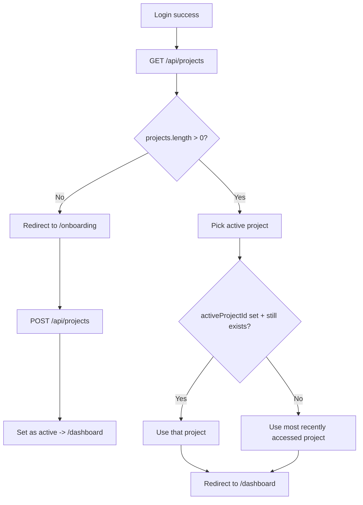

# Backend Spec — Projects & Post-Login Onboarding

> Status: proposed
> Audience: backend team
> Related frontend: `AuthPage`, `OnboardingPage`, `ProjectDropdown`, `src/utils/api.js`

## 1. Goal

Authentication is already implemented. This spec covers the **Project** resource and the
**post-login routing logic** that depends on it.

Desired behavior after a successful login:

1. The frontend asks the backend for the current user's projects.
2. **If the user has no projects** → show the **onboarding / create-project** page.
3. **If the user has one or more projects** → skip onboarding and go straight to the workspace
   (`/dashboard`).
4. **If the user has multiple projects** → automatically select the **last active** project
   (the one they used most recently). The user can switch projects at any time from the
   project dropdown.

This replaces the current `user.onboardingCompleted` boolean as the source of truth.
Onboarding is now derived from "does the user have at least one project?".

## 2. Decision flow



## 3. Data model

### 3.1 Project

| Field         | Type                | Notes                                                        |
| ------------- | ------------------- | ----------------------------------------------------------- |
| `id`          | string (uuid)       | Primary key                                                  |
| `ownerId`     | string (uuid)       | FK → user. Owner of the project                             |
| `name`        | string              | Required, 1–80 chars                                         |
| `icon`        | string              | Short glyph/emoji used in UI (e.g. `▶`, `✦`). Optional      |
| `color`       | string              | Hex color, e.g. `#2563eb`. Optional                          |
| `org`         | string              | Optional label/group (e.g. `Personal`, `Admart`)            |
| `lastAccessedAt` | datetime \| null | Updated whenever the user opens/activates this project       |
| `createdAt`   | datetime            |                                                             |
| `updatedAt`   | datetime            |                                                             |

> The frontend's current seed objects use exactly: `id`, `name`, `color`, `icon`, `org`,
> `updatedAt`. Matching these field names keeps the UI change minimal.

### 3.2 Tracking the "active / last used" project

Pick **one** of these approaches (recommendation: **A**, it's simplest):

- **A. Per-project `lastAccessedAt`** (recommended)
  - When a project is opened/activated, set its `lastAccessedAt = now()`.
  - "Active project" = the project with the most recent `lastAccessedAt`.
  - No extra column on the user table; naturally handles deletion.

- **B. `activeProjectId` on the user**
  - Store the user's current selection explicitly on the user record.
  - Must be nulled/repaired if that project is deleted.
  - Useful if you want an explicit pointer separate from recency.

If you implement B, still keep `lastAccessedAt` as a fallback for "most recent" ordering.

## 4. API endpoints

All endpoints:

- Are under the existing API base (frontend uses `VITE_API_URL`, default `http://localhost:8000`).
- Require the standard `Authorization: Bearer <accessToken>` (same interceptor as `/api/auth/me`).
- Operate **only** on projects owned by the authenticated user. Accessing another user's
  project returns `404` (preferred over `403` to avoid leaking existence).
- Return JSON. Timestamps are ISO‑8601 strings.

### 4.1 List projects

```
GET /api/projects
```

Returns the user's projects, **ordered by `lastAccessedAt` desc** (nulls last, then
`createdAt` desc). This ordering lets the frontend treat `projects[0]` as the
auto-detected active project when no explicit selection exists.

**200 Response**

```json
{
  "projects": [
    {
      "id": "5f1c0c2e-...",
      "name": "Summer Campaign",
      "icon": "☀",
      "color": "#7c3aed",
      "org": "Admart",
      "lastAccessedAt": "2026-06-22T10:15:00.000Z",
      "createdAt": "2026-05-01T09:00:00.000Z",
      "updatedAt": "2026-06-22T10:15:00.000Z"
    }
  ],
  "activeProjectId": "5f1c0c2e-..."
}
```

- `activeProjectId`: the explicit selection if approach B is used; otherwise return the id of
  the most-recently-accessed project (i.e. `projects[0].id`), or `null` if the list is empty.
- An **empty** `projects` array is the signal the frontend uses to show onboarding.

### 4.2 Create project

```
POST /api/projects
```

**Request body**

```json
{
  "name": "My First Project",
  "icon": "▶",
  "color": "#2563eb",
  "org": "Personal"
}
```

- `name` required (1–80 chars). `icon`, `color`, `org` optional (server may apply defaults).
- On create, set `lastAccessedAt = now()` so the new project becomes active immediately.

**201 Response** — the created project object (same shape as a list item).

**Validation errors** → `422` with `{ "message": "...", "errors": { "name": "Required" } }`.

### 4.3 Get a single project

```
GET /api/projects/:id
```

`200` → project object, or `404` if not found / not owned.

### 4.4 Update a project

```
PATCH /api/projects/:id
```

Partial update of `name` / `icon` / `color` / `org`. `200` → updated project.

### 4.5 Delete a project

```
DELETE /api/projects/:id
```

`204` on success. If the deleted project was the active one (approach B), clear
`activeProjectId` (frontend will fall back to most-recent).

### 4.6 Set active / mark as accessed

```
POST /api/projects/:id/activate
```

Called when the user switches projects in the dropdown, or when the workspace loads with a
given project. Behavior:

- Set that project's `lastAccessedAt = now()`.
- If using approach B, also set the user's `activeProjectId = :id`.

`200` → `{ "activeProjectId": ":id" }` (or the updated project).

## 5. Auth / onboarding interaction

- Keep the existing `GET/PATCH /api/auth/me`.
- **Recommendation:** make `onboardingCompleted` **derived**, not authoritative. The
  authoritative signal is "user has ≥ 1 project". You may keep the field for analytics, but the
  frontend will base routing on `GET /api/projects`.
- Optional convenience: include `projectCount` (and `activeProjectId`) on the `/api/auth/me`
  response so the frontend can decide routing from a single call right after login, without a
  second round-trip.

```json
// GET /api/auth/me (optional additions)
{
  "id": "...",
  "email": "...",
  "firstName": "...",
  "projectCount": 2,
  "activeProjectId": "5f1c0c2e-..."
}
```

## 6. Errors

| Status | When                                              | Body                                              |
| ------ | ------------------------------------------------- | ------------------------------------------------- |
| 401    | Missing/expired token (handled by interceptor)    | `{ "message": "Unauthorized" }`                   |
| 404    | Project not found or not owned by the user        | `{ "message": "Project not found" }`              |
| 422    | Validation failed                                 | `{ "message": "...", "errors": { ... } }`         |
| 500    | Unexpected                                        | `{ "message": "Internal server error" }`          |

## 7. Frontend changes this enables (for reference — not backend work)

These are the corresponding frontend edits once the APIs exist:

1. **`AuthPage`** — after login, instead of branching on `onboardingCompleted`:
   - call `GET /api/projects`;
   - `projects.length === 0` → `navigate('/onboarding')`;
   - else set active project (from `activeProjectId`, else `projects[0]`) and
     `navigate('/dashboard')`.
2. **`OnboardingPage`** — replace `localStorage`-only `persistProject()` with
   `POST /api/projects`, then navigate to `/dashboard`. "Skip" can be disallowed, or create a
   default project, since a user now needs at least one project to enter the workspace.
3. **`ProjectDropdown`** — replace the hardcoded `SEED_PROJECTS` with `GET /api/projects`,
   and call `POST /api/projects/:id/activate` in `selectProject()`. The "New Project" footer
   button calls `POST /api/projects`.

## 8. Open questions for the team

1. Should **Skip** on onboarding be removed, or should it create a default project? (A user
   needs ≥ 1 project to reach the workspace under this model.)
2. Tracking model — go with **A (`lastAccessedAt`)** or **B (`activeProjectId`)**?
3. Will projects ever be **shared** between users (org/team membership), or strictly
   single-owner for now? This affects the ownership/authorization checks in §4.
