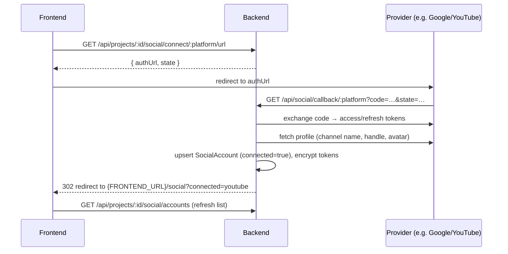

# Backend Spec — Social Media Account Connections

> Status: proposed
> Audience: backend team
> Companion docs: `frontend-integration.md`, `docs/backend-project-onboarding.md`
> Related frontend: `src/pages/SocialAccountsPage.jsx`, `src/utils/projects.js`

## 1. Overview

The Social Accounts page lets a user connect their social platforms to a **project**.
Connections are **per project** (not per user) — switching projects switches the connected
accounts. Each connection is a real **OAuth 2.0** link so we can publish on the user's behalf
and read basic profile/insights. We never store user passwords.

### Platforms shown in the UI

| Platform   | Key (`:platform`) | Priority         |
| ---------- | ----------------- | ---------------- |
| YouTube    | `youtube`         | **1 — do first** |
| TikTok     | `tiktok`          | later            |
| Instagram  | `instagram`       | later            |
| Facebook   | `facebook`        | later            |

> **Implementation order:** build and ship **YouTube** end-to-end first. The other three
> reuse the exact same endpoints and data model — only the provider-specific OAuth config and
> profile mapping differ (see §7). Until a platform is implemented, its connect call should
> return a clear "not available yet" error (see §6) so the UI can disable it gracefully.

## 2. Data model — `SocialAccount`

One row per connected (or previously connected) platform per project.

| Field            | Type                | Notes                                                            |
| ---------------- | ------------------- | --------------------------------------------------------------- |
| `id`             | string (uuid)       | Primary key                                                      |
| `projectId`      | string (uuid)       | FK → project. Connection is scoped to this project              |
| `platform`       | enum                | `youtube` \| `tiktok` \| `instagram` \| `facebook`              |
| `connected`      | boolean             | `true` while the OAuth link is active                            |
| `handle`         | string \| null      | e.g. `@vidify` / channel handle                                  |
| `displayName`    | string \| null      | Channel / account display name                                  |
| `avatarUrl`      | string \| null      | Profile image URL                                               |
| `externalId`     | string \| null      | Provider account/channel id                                     |
| `tokenExpiresAt` | datetime \| null    | When the current access token expires                           |
| `createdAt`      | datetime            |                                                                 |
| `updatedAt`      | datetime            |                                                                 |

**Secret fields (never returned to the frontend):**

| Field           | Notes                                                       |
| --------------- | ---------------------------------------------------------- |
| `accessToken`   | Encrypted at rest                                          |
| `refreshToken`  | Encrypted at rest                                          |
| `scope`         | Granted scopes (space-delimited)                           |

The frontend already expects exactly this public shape (see `SocialAccountsPage.jsx`):

```json
{
  "id": "…",
  "projectId": "5f1c0c2e-…",
  "platform": "youtube",
  "handle": "@vidify",
  "displayName": "Vidify Official",
  "connected": true,
  "avatarUrl": "https://…",
  "tokenExpiresAt": "2026-09-01T00:00:00Z",
  "createdAt": "2026-06-22T10:15:00Z"
}
```

## 3. OAuth connection flow

A direct "connect" can't just flip a boolean — the user must authorize on the provider.
Use the standard redirect (authorization-code) flow:



- `state` is a signed/opaque value that encodes at least `projectId` + `platform` + a random
  nonce, and is verified in the callback (CSRF protection). Store it server-side or sign it.
- The callback ends with a **302 redirect** back to the app (`/social`) with a small query flag
  so the UI can show a success/error toast.

## 4. Endpoints

All require `Authorization: Bearer <accessToken>` **except** the provider callback (§4.3),
which is reached via browser redirect from the provider and is secured by `state`.

### 4.1 List connected accounts

```
GET /api/projects/:id/social/accounts
```

`200` → array of public `SocialAccount` objects (see §2). Already consumed by the frontend.
Return a row only when it has been (or is) connected; unconnected platforms can simply be
absent from the array — the UI renders those as "Not Connected".

### 4.2 Begin connection (get authorize URL)

```
GET /api/projects/:id/social/connect/:platform/url
```

Builds the provider authorization URL with the right scopes + redirect URI + `state`.

`200`

```json
{
  "authUrl": "https://accounts.google.com/o/oauth2/v2/auth?...",
  "state": "signed-opaque-string"
}
```

- `404` if the project isn't owned by the user.
- `400` / `501` if the platform isn't implemented yet (see §6).

> Note: the current frontend has a placeholder `POST /api/projects/:id/social/connect/:platform`
> (in `src/utils/projects.js`). Once this URL endpoint exists, the frontend will switch to
> "fetch authUrl → redirect". You can keep/remove the old POST; treat **this** URL flow as the
> real contract.

### 4.3 OAuth callback (provider redirect)

```
GET /api/social/callback/:platform?code=…&state=…
```

- Verify `state`; resolve `projectId` + `platform` from it.
- Exchange `code` for `access_token` + `refresh_token`.
- Fetch the provider profile and populate `handle` / `displayName` / `avatarUrl` / `externalId`.
- Upsert the `SocialAccount` (one per project+platform), `connected = true`, store encrypted
  tokens + `tokenExpiresAt`.
- Respond `302` → `{FRONTEND_URL}/social?connected=:platform` (or `?error=:platform` on failure).

### 4.4 Disconnect

```
DELETE /api/projects/:id/social/disconnect/:platform
```

Soft-disconnect: set `connected = false`, revoke the token with the provider if possible, and
clear/scrub stored tokens. `200` on success, `404` if there's no such connection. Already
consumed by the frontend (`disconnectPlatform`).

### 4.5 (Optional) Manual token refresh

```
POST /api/projects/:id/social/refresh/:platform
```

Force a refresh using the stored `refresh_token`; update `tokenExpiresAt`. Normally refresh
should happen automatically server-side before publishing, so this is optional/admin.

## 5. YouTube (Google) — first integration

- **OAuth client:** Google Cloud OAuth 2.0 client (Web application).
- **Env vars (suggested):**
  - `GOOGLE_OAUTH_CLIENT_ID`
  - `GOOGLE_OAUTH_CLIENT_SECRET`
  - `YOUTUBE_OAUTH_REDIRECT_URI` = `{API_BASE}/api/social/callback/youtube`
  - `FRONTEND_URL` = e.g. `http://localhost:5173` (where to redirect back to `/social`)
- **Authorization params:** `access_type=offline` and `prompt=consent` so we always receive a
  **refresh token**; `include_granted_scopes=true`.
- **Scopes (start minimal, expand as needed):**
  - `https://www.googleapis.com/auth/youtube.readonly` — read channel profile/stats
  - `https://www.googleapis.com/auth/youtube.upload` — publish videos (needed for posting)
- **Profile fetch after token exchange:** `GET https://www.googleapis.com/youtube/v3/channels?part=snippet&mine=true`
  → map `snippet.title` → `displayName`, `snippet.customUrl` → `handle`,
  `snippet.thumbnails.default.url` → `avatarUrl`, channel `id` → `externalId`.
- **Token lifetime:** access tokens ~1 hour; use the refresh token to renew. Persist
  `tokenExpiresAt` so we can refresh proactively before publishing.

> The existing app already uses Google OAuth for **login** (`VITE_GOOGLE_CLIENT_ID`,
> `POST /api/auth/google`). The YouTube connection is a **separate** authorization with
> YouTube scopes and its own redirect URI — do not reuse the login tokens.

## 6. Errors

| Status | When                                                        | Body                                                  |
| ------ | ----------------------------------------------------------- | ----------------------------------------------------- |
| 401    | Missing/expired app token                                   | `{ "message": "Unauthorized" }`                       |
| 404    | Project/connection not found or not owned by the user       | `{ "message": "Not found" }`                          |
| 400    | Unknown platform key                                        | `{ "message": "Unsupported platform" }`               |
| 501    | Platform not implemented yet (e.g. tiktok before build)     | `{ "message": "youtube only for now", "platform": "tiktok" }` |
| 502    | Provider token exchange / profile fetch failed              | `{ "message": "Provider error" }`                     |

> Returning `501` for not-yet-built platforms lets the UI disable those buttons cleanly while
> YouTube ships first.

## 6b. Video publishing / auto-upload (core requirement)

Users must be able to **auto-upload videos to YouTube from our platform**. The connection in
§3–§5 exists primarily to enable this. Publishing uses the connected account's stored tokens.

### Endpoint

```
POST /api/projects/:id/social/youtube/upload
```

**Request** (the video source is a platform-generated asset)

```json
{
  "videoId": "internal-asset-id",          // our generated video, or a file/URL reference
  "title": "My video title",
  "description": "…",
  "tags": ["ai", "shorts"],
  "privacyStatus": "public",                 // public | unlisted | private
  "categoryId": "22"
}
```

- Resolve the connected YouTube `SocialAccount` for the project; `404` if not connected.
- Ensure a valid access token: if `tokenExpiresAt` is past/near, refresh with the stored
  `refresh_token` **before** uploading.
- Upload via YouTube Data API v3 `videos.insert` using the **resumable upload** protocol
  (`uploadType=resumable`), `part=snippet,status`.
- Persist the returned YouTube `videoId` / URL against our asset for status tracking.

`202`/`200` → `{ "youtubeVideoId": "…", "url": "https://youtu.be/…", "privacyStatus": "…" }`.

### Required scope

`https://www.googleapis.com/auth/youtube.upload` is mandatory for this (already in §5). Request
it at connect time so we never need a second authorization before the first upload.

### ⚠️ Two hard constraints to plan for now

1. **App audit / verification (privacy lock).** `youtube.upload` is a *sensitive* scope. Until
   the Google Cloud project passes the **YouTube API Services audit**, videos uploaded via the
   API are **forced to `private`** regardless of the `privacyStatus` we send — they cannot be
   made public/unlisted. Test users in "Testing" mode can upload, but still private-locked.
   → To ship real public auto-uploads we must submit the app for audit. Start this early; it
   takes time.
2. **Quota.** Default YouTube Data API quota is **10,000 units/day**, and each `videos.insert`
   costs **~1,600 units** → only ~6 uploads/day by default. For real usage we must request a
   **quota increase** from Google. Track usage and surface a friendly error on quota-exceeded
   (`403 quotaExceeded`).

### Publishing flow

```mermaid
sequenceDiagram
    participant FE as Frontend
    participant BE as Backend
    participant G as Google/YouTube
    FE->>BE: POST /api/projects/:id/social/youtube/upload (videoId, title, …)
    BE->>BE: load SocialAccount tokens; refresh if expired
    BE->>G: videos.insert (resumable upload, snippet+status)
    G-->>BE: { id: youtubeVideoId }
    BE->>BE: store youtubeVideoId + url on the asset
    BE-->>FE: { youtubeVideoId, url, privacyStatus }
```

## 7. Adding the other platforms later (same shape)

Each later platform only needs its own OAuth app + config; the endpoints and `SocialAccount`
model stay identical.

| Platform   | OAuth provider / notes                                                                 |
| ---------- | ------------------------------------------------------------------------------------- |
| TikTok     | TikTok for Developers (Login Kit + Content Posting API). Scopes for video publish.    |
| Instagram  | Instagram Graph API via Facebook Login (Business/Creator accounts).                   |
| Facebook   | Facebook Login + Pages API (manage_posts, pages_read_engagement).                     |

## 8. Security checklist

- [ ] Encrypt `accessToken` / `refreshToken` at rest; never return them in any response.
- [ ] Verify `state` on callback (CSRF) and bind it to the requesting user + project.
- [ ] Scope every query by the authenticated user → project ownership (404 on mismatch).
- [ ] Revoke tokens with the provider on disconnect where supported.
- [ ] Validate `:platform` against the allow-list before doing anything.

## 9. Open questions

1. Multiple accounts of the **same** platform per project (the UI hints at "Add another
   account"), or exactly one per platform per project for now? (Spec above assumes **one**.)
2. Do we need publish/insights scopes immediately, or is read-only profile enough for the first
   YouTube milestone?
3. Should disconnect hard-delete the row or keep it as `connected:false` history? (Spec assumes
   soft-disconnect.)
