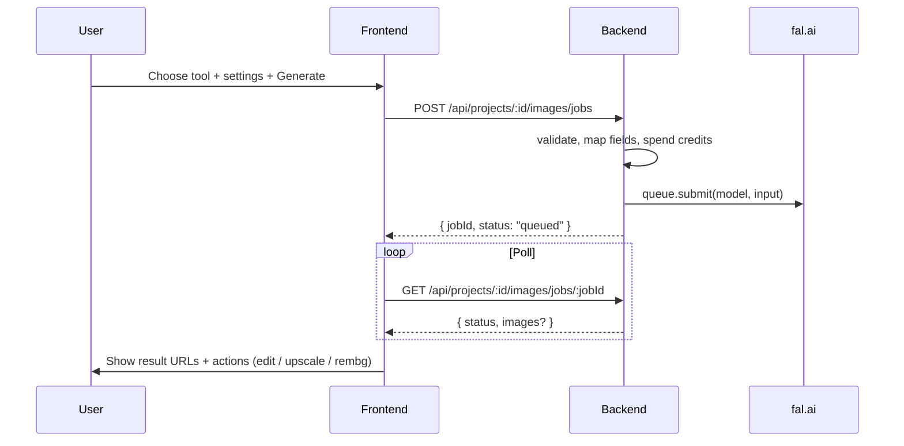

# Frontend Guide — Image Generation & Editing (fal.ai)

> Audience: frontend team  
> Provider: **fal.ai** (backend holds `FAL_KEY` — never call fal from the browser)  
> Status: **Guidelines / contract draft** — generation API not wired yet; build UI against this shape  
> Pairs with: `ARCHITECTURE.md`, `frontend-integration.md`

---

## 0. Mental model

Admart image tools are **capabilities**, not raw fal models.

| Capability (UI tool) | What the user does | Typical fal endpoint(s) |
| -------------------- | ------------------ | ----------------------- |
| **Text to image** | Prompt → new image | `fal-ai/flux/dev`, `fal-ai/nano-banana-2`, … |
| **Image edit** | Prompt + 1 image → edited image | `fal-ai/nano-banana-2/edit`, `fal-ai/flux-pro/kontext`, … |
| **Multi-image edit** | Prompt + 2+ images → compose / transfer | `fal-ai/nano-banana-pro/edit` (`image_urls[]`) |
| **Upscale** | Image → higher res | `fal-ai/esrgan`, `fal-ai/seedvr/upscale/image`, … |
| **Remove background** | Image → transparent PNG | `fal-ai/birefnet`, `fal-ai/bria/background/remove`, … |
| **Ideogram design** | Prompt → poster / logo / text-heavy | `fal-ai/ideogram/v3` |

**Rules for FE:**

1. Call **our backend only** (JWT). Never put `FAL_KEY` in Vite env for browser use.
2. Send a **unified camelCase payload**. Backend maps to fal’s snake_case + model-specific fields.
3. Treat generation as **async jobs**: submit → poll → show `images[].url`.
4. Scope everything to the **active project** (`projectId`).



> Exact backend paths above are **proposed**. Until they ship, mock with the same shapes so FE isn’t blocked.

---

## 1. UI information architecture

Recommended studio layout (one page, tool tabs):

```
[ Project switcher ]

[ Tools ]
  Text to image | Edit | Multi-edit | Upscale | Remove BG

[ Left: settings panel ]     [ Center: canvas / results ]
  - Model                    - Prompt / dropzone
  - Aspect / size            - Progress
  - Advanced (collapsed)     - Gallery of outputs
                             - Actions: Download | Edit | Upscale | Remove BG | Use as input
```

**Chaining:** every output URL can become the next tool’s input (`imageUrls: [result.url]`). That’s how “generate → rembg → upscale” works without special glue.

---

## 2. Unified request / response (frontend contract)

### 2.1 Create job — proposed

`POST /api/projects/:projectId/images/jobs`

```ts
type ImageCapability =
  | "textToImage"
  | "edit"
  | "multiEdit"
  | "upscale"
  | "removeBackground";

type AspectRatio =
  | "auto"
  | "1:1"
  | "16:9"
  | "9:16"
  | "4:3"
  | "3:4"
  | "3:2"
  | "2:3"
  | "21:9";

type ImageJobCreateRequest = {
  capability: ImageCapability;
  /** fal model id; omit to use project/server default for that capability */
  model?: string;

  // --- common ---
  prompt?: string;              // required for textToImage, edit, multiEdit
  negativePrompt?: string;      // Ideogram / some Flux variants
  imageUrls?: string[];         // required for edit/upscale/rembg; 2+ for multiEdit
  aspectRatio?: AspectRatio;
  numImages?: number;           // default 1, typically 1–4
  seed?: number | null;
  outputFormat?: "jpeg" | "png" | "webp";

  // --- Nano Banana / Google family ---
  resolution?: "0.5K" | "1K" | "2K" | "4K";
  systemPrompt?: string;
  enableWebSearch?: boolean;
  thinkingLevel?: "minimal" | "high";

  // --- Flux family ---
  imageSize?:                   // alternative to aspectRatio; backend may accept either
    | "square_hd"
    | "square"
    | "portrait_4_3"
    | "portrait_16_9"
    | "landscape_4_3"
    | "landscape_16_9"
    | { width: number; height: number };
  numInferenceSteps?: number;
  guidanceScale?: number;
  acceleration?: "none" | "regular" | "high";
  enableSafetyChecker?: boolean;

  // --- Ideogram ---
  style?: "AUTO" | "GENERAL" | "REALISTIC" | "DESIGN";
  stylePreset?: string;
  renderingSpeed?: "TURBO" | "BALANCED" | "QUALITY";
  expandPrompt?: boolean;

  // --- Upscale ---
  scale?: number;               // e.g. 2, 4
  faceEnhance?: boolean;
  upscaleModel?: string;        // ESRGAN variant, etc.

  // --- Remove background ---
  rembgModel?: "light" | "heavy" | "portrait";
  operatingResolution?: "1024x1024" | "2048x2048";
  outputMask?: boolean;
  refineForeground?: boolean;
};
```

### 2.2 Job response

```ts
type ImageJobStatus = "queued" | "running" | "succeeded" | "failed";

type ImageAsset = {
  url: string;
  width?: number;
  height?: number;
  contentType?: string;
  fileName?: string;
};

type ImageJob = {
  id: string;
  projectId: string;
  capability: ImageCapability;
  model: string;
  status: ImageJobStatus;
  prompt?: string;
  images: ImageAsset[];         // empty until succeeded
  maskImage?: ImageAsset | null; // rembg optional
  error?: string | null;
  creditsUsed?: number;
  seed?: number | null;
  createdAt: string;
  updatedAt: string;
};
```

### 2.3 Poll

`GET /api/projects/:projectId/images/jobs/:jobId` → `ImageJob`

Suggested poll: every **1.5–2s**, stop on `succeeded` | `failed`, max ~3–5 minutes.

### 2.4 Upload source images (edit / rembg / upscale)

Users pick local files → FE uploads to **our** backend (or signed upload) → get public HTTPS URLs → pass as `imageUrls`.

Do **not** send multi‑MB base64 to the generate endpoint if an upload API exists.

Proposed:

`POST /api/projects/:projectId/images/uploads` (multipart) → `{ url }`

---

## 3. Capability specs (what to show in the UI)

### 3.1 Text to image

**Required UI fields**

| Field | Required | Control |
| ----- | -------- | ------- |
| Prompt | **yes** | textarea |
| Model | no | select (see §4) |
| Aspect ratio | no | chips / select |
| Num images | no | stepper 1–4 |

**Advanced (collapsed)**

| Field | Models that use it |
| ----- | ------------------ |
| Seed | all |
| Output format | all |
| Resolution (`1K`/`2K`/`4K`) | Nano Banana family |
| System prompt | Nano Banana |
| Guidance / steps / acceleration | Flux |
| Negative prompt, style, style preset, rendering speed | Ideogram |
| Enable web search / thinking | Nano Banana 2 |

**Example payload**

```json
{
  "capability": "textToImage",
  "model": "fal-ai/flux/dev",
  "prompt": "Product shot of a matte black water bottle on marble, soft studio light",
  "aspectRatio": "1:1",
  "numImages": 1,
  "outputFormat": "png"
}
```

---

### 3.2 Image edit (single image)

**Required**

| Field | Required | Notes |
| ----- | -------- | ----- |
| Prompt | **yes** | edit instruction (“make the sky sunset”) |
| `imageUrls[0]` | **yes** | one source image URL |
| Model | no | default edit model |

**Recommended models**

| Model id | Good for |
| -------- | -------- |
| `fal-ai/nano-banana-2/edit` | Fast, colourful edits |
| `fal-ai/nano-banana-pro/edit` | Dense / precise edits |
| `fal-ai/flux-pro/kontext` | Photoreal local edits / scene preserve |

**Example**

```json
{
  "capability": "edit",
  "model": "fal-ai/nano-banana-2/edit",
  "prompt": "Replace the background with a soft beige studio backdrop",
  "imageUrls": ["https://cdn.example.com/uploads/product.png"],
  "aspectRatio": "auto",
  "resolution": "1K"
}
```

**UI:** dropzone → preview → prompt → Generate. After success, offer **Upscale** / **Remove BG**.

---

### 3.3 Multi-image edit (compose / transfer)

Same as edit, but **2+ images** in `imageUrls`.

Use when:

- “Put person from image A into scene from image B”
- Brand logo + product shot → ad creative
- Style reference + content image

**Recommended:** `fal-ai/nano-banana-pro/edit` (explicitly documents multiple `image_urls`).

**UI rules**

- Min 2 images, show ordered thumbnails (order can matter — label “Subject”, “Scene”, “Style”).
- Prompt should reference roles: “Use image 1 as the subject, image 2 as the background…”
- Cap uploads (e.g. max 4–6) to control cost/latency.

```json
{
  "capability": "multiEdit",
  "model": "fal-ai/nano-banana-pro/edit",
  "prompt": "Place the person from the first image into the cafe from the second image, keep lighting consistent",
  "imageUrls": [
    "https://cdn.example.com/person.png",
    "https://cdn.example.com/cafe.png"
  ],
  "resolution": "1K"
}
```

Optional advanced (Nano Banana 2 edit also supports): `videoUrl`, `audioUrl`, `pdfUrl` as extra context — hide under Advanced unless product needs them.

---

### 3.4 Upscale

**Required:** `imageUrls[0]`  
**Prompt:** usually **not** required (except Ideogram upscale / creative upscalers that accept a refine prompt).

| Field | Control | Notes |
| ----- | ------- | ----- |
| Scale | select `2` / `4` | maps to ESRGAN `scale` |
| Face enhance | toggle | ESRGAN `face` |
| Model | select | see §4.4 |

```json
{
  "capability": "upscale",
  "model": "fal-ai/esrgan",
  "imageUrls": ["https://cdn.example.com/draft.png"],
  "scale": 2,
  "faceEnhance": true
}
```

**UI tip:** disable Generate until an image is present; show before/after slider.

---

### 3.5 Remove background

**Required:** `imageUrls[0]`  
**No prompt.**

| Field | Control | Maps to BiRefNet |
| ----- | ------- | ---------------- |
| Quality | Light / Heavy / Portrait | `rembgModel` |
| Operating resolution | 1024 / 2048 | `operatingResolution` |
| Output mask | toggle | `outputMask` |
| Refine foreground | toggle (default on) | `refineForeground` |
| Output format | prefer `png` | transparency |

```json
{
  "capability": "removeBackground",
  "model": "fal-ai/birefnet",
  "imageUrls": ["https://cdn.example.com/product.jpg"],
  "rembgModel": "light",
  "operatingResolution": "1024x1024",
  "outputFormat": "png",
  "outputMask": false,
  "refineForeground": true
}
```

**UI:** checkerboard preview for transparency; Download PNG.

---

## 4. Model catalog (for FE selects)

Backend can later expose `GET /api/images/models` so FE doesn’t hardcode. Until then, use this list.

### 4.1 Text to image

| Label | Model id | Strength | Size control |
| ----- | -------- | -------- | ------------ |
| Flux Dev (default) | `fal-ai/flux/dev` | Balanced quality | `imageSize` enums |
| Flux Schnell | `fal-ai/flux/schnell` | Fast / cheap drafts | same as Flux |
| Nano Banana 2 | `fal-ai/nano-banana-2` | Fast Google quality | `aspectRatio` + `resolution` |
| Nano Banana Pro | `fal-ai/nano-banana-pro` | Higher fidelity | `aspectRatio` + `resolution` |
| Ideogram V3 | `fal-ai/ideogram/v3` | Text / posters / logos | `imageSize` + styles |
| GPT Image 2 | `openai/gpt-image-2` | Best typography | `imageSize` (+ `quality`) |

\*Confirm exact endpoint id in [fal explore](https://fal.ai/explore/best-ai-image-generators) before shipping — ids change when fal renames partner models.

### 4.2 Edit / multi-edit

| Label | Model id | Multi-image |
| ----- | -------- | ----------- |
| Nano Banana 2 Edit | `fal-ai/nano-banana-2/edit` | yes (`image_urls`) |
| Nano Banana Pro Edit | `fal-ai/nano-banana-pro/edit` | yes (recommended) |
| Flux Kontext Pro | `fal-ai/flux-pro/kontext` | typically single |
| GPT Image 2 Edit | `openai/gpt-image-2/edit` | yes (`image_urls`) |

### 4.3 Upscale

| Label | Model id | Notes |
| ----- | -------- | ----- |
| ESRGAN (default) | `fal-ai/esrgan` | `scale`, `face`, model variants |
| SeedVR2 | `fal-ai/seedvr/upscale/image` | high quality |
| Topaz | `fal-ai/topaz/upscale/image` | premium |
| Recraft Crisp | `fal-ai/recraft/upscale/crisp` | details / faces |
| Ideogram Upscale | `fal-ai/ideogram/upscale` | optional refine prompt |

### 4.4 Remove background

| Label | Model id | Notes |
| ----- | -------- | ----- |
| BiRefNet (default) | `fal-ai/birefnet` | light/heavy/portrait |
| Bria RMBG 2.0 | `fal-ai/bria/background/remove` | commercial-safe licensing |

### 4.5 Settings visibility matrix

Show/hide Advanced fields from `model` + `capability`:

| Setting | textToImage Flux | textToImage Nano | textToImage Ideogram | edit Nano | upscale ESRGAN | rembg |
| ------- | ---------------- | ---------------- | -------------------- | --------- | -------------- | ----- |
| prompt | ● | ● | ● | ● | ○ | ○ |
| imageUrls | ○ | ○ | ○ | ● | ● | ● |
| aspectRatio / imageSize | ● | ● | ● | ● | ○ | ○ |
| resolution | ○ | ● | ○ | ● | ○ | ○ |
| numImages | ● | ● | ● | ● | ○ | ○ |
| seed | ● | ● | ● | ● | ○ | ○ |
| guidance / steps | ● | ○ | ○ | ○ | ○ | ○ |
| negativePrompt / style | ○ | ○ | ● | ○ | ○ | ○ |
| scale / faceEnhance | ○ | ○ | ○ | ○ | ● | ○ |
| rembg options | ○ | ○ | ○ | ○ | ○ | ● |

● = show · ○ = hide

---

## 5. Aspect ratio ↔ backend mapping

Frontend should prefer **one** UX control: `aspectRatio` chips.

Backend maps when the fal model wants Flux-style `image_size`:

| UI `aspectRatio` | Flux `image_size` |
| ---------------- | ----------------- |
| `1:1` | `square_hd` |
| `16:9` | `landscape_16_9` |
| `9:16` | `portrait_16_9` |
| `4:3` | `landscape_4_3` |
| `3:4` | `portrait_4_3` |
| `auto` | omit / model default |

Nano Banana: pass `aspectRatio` through as `aspect_ratio` unchanged.

---

## 6. Suggested TypeScript constants (FE)

```ts
export const IMAGE_CAPABILITIES = [
  { id: "textToImage", label: "Text to image", needsPrompt: true, minImages: 0 },
  { id: "edit", label: "Edit", needsPrompt: true, minImages: 1 },
  { id: "multiEdit", label: "Multi-image edit", needsPrompt: true, minImages: 2 },
  { id: "upscale", label: "Upscale", needsPrompt: false, minImages: 1 },
  { id: "removeBackground", label: "Remove background", needsPrompt: false, minImages: 1 },
] as const;

export const TEXT_TO_IMAGE_MODELS = [
  { id: "fal-ai/flux/dev", label: "Flux Dev", family: "flux" },
  { id: "fal-ai/flux/schnell", label: "Flux Schnell", family: "flux" },
  { id: "fal-ai/nano-banana-2", label: "Nano Banana 2", family: "nano" },
  { id: "fal-ai/nano-banana-pro", label: "Nano Banana Pro", family: "nano" },
  { id: "fal-ai/ideogram/v3", label: "Ideogram V3", family: "ideogram" },
] as const;

export const EDIT_MODELS = [
  { id: "fal-ai/nano-banana-2/edit", label: "Nano Banana 2 Edit", family: "nano" },
  { id: "fal-ai/nano-banana-pro/edit", label: "Nano Banana Pro Edit", family: "nano" },
  { id: "fal-ai/flux-pro/kontext", label: "Flux Kontext Pro", family: "flux" },
  { id: "openai/gpt-image-2/edit", label: "GPT Image 2 Edit", family: "openai" },
] as const;

export const UPSCALE_MODELS = [
  { id: "fal-ai/esrgan", label: "ESRGAN" },
  { id: "fal-ai/seedvr/upscale/image", label: "SeedVR2" },
  { id: "fal-ai/topaz/upscale/image", label: "Topaz" },
] as const;

export const REMBG_MODELS = [
  { id: "fal-ai/birefnet", label: "BiRefNet" },
  { id: "fal-ai/bria/background/remove", label: "Bria RMBG" },
] as const;

export const ASPECT_RATIOS = [
  "1:1", "16:9", "9:16", "4:3", "3:4", "auto",
] as const;
```

---

## 7. Validation rules (client-side)

| Capability | Block Generate if |
| ---------- | ----------------- |
| textToImage | `prompt` empty / whitespace |
| edit | no `prompt` or no `imageUrls[0]` |
| multiEdit | no `prompt` or `imageUrls.length < 2` |
| upscale | no `imageUrls[0]` |
| removeBackground | no `imageUrls[0]` |

Also:

- Max prompt length: **~2000** chars (UI soft limit; fal varies).
- Image MIME: `image/jpeg`, `image/png`, `image/webp`.
- Max file size: agree with backend (suggest **10–15 MB** per file).

---

## 8. UX states

| State | UI |
| ----- | -- |
| Idle | settings + empty canvas CTA |
| Uploading | progress on dropzone |
| Queued / Running | spinner + “Generating…” + cancel if API supports |
| Succeeded | grid of images; primary actions |
| Failed | inline error from `job.error`; keep form values |
| Insufficient credits | `402` / dedicated code → paywall / buy credits |

Result actions (per image):

1. Download  
2. **Edit** (prefill `edit` + this URL)  
3. **Upscale**  
4. **Remove background**  
5. Set as brand asset / attach to post (later)

---

## 9. Security & product constraints

- **Never** expose `FAL_KEY` to the client.
- Always send `Authorization: Bearer <accessToken>`.
- Always use **active `projectId`** from auth/project context.
- Credits: show **`creditsRemaining`** (not `creditsTotal`) from `/api/auth/me` before generate; disable when `0`.
  - `creditsTotal` = plan allotment (e.g. 5 free). `creditsRemaining` = what you can spend now.
  - On `202` create-job, read `creditsRemaining` from the response and update the badge.
  - On `402` `{ code: "INSUFFICIENT_CREDITS" }`, same fields are in the body — show paywall / “out of credits”.
- NSFW / safety: Flux has `enableSafetyChecker`; Nano has `safetyTolerance` — keep defaults; don’t surface “unsafe” toggles in consumer UI unless product asks.

---

## 10. Phased frontend rollout

| Phase | Ship |
| ----- | ---- |
| **P0** | Text to image only: prompt + aspect + 1–2 models (`flux/dev`, `nano-banana-2`) |
| **P1** | Edit + Remove BG + chain actions |
| **P2** | Multi-edit + Upscale + model picker per capability |
| **P3** | Advanced settings, Ideogram styles, web search / thinking |

Backend config-only (`FAL_KEY` + default models) can land before P0 API; FE can mock jobs until then.

---

## 11. Raw fal field reference (for engineers)

Backend maps camelCase → these snake_case names:

| Our field | fal field |
| --------- | --------- |
| `prompt` | `prompt` |
| `negativePrompt` | `negative_prompt` |
| `imageUrls` | `image_urls` / `image_url` (singular tools) |
| `aspectRatio` | `aspect_ratio` |
| `imageSize` | `image_size` |
| `numImages` | `num_images` |
| `numInferenceSteps` | `num_inference_steps` |
| `guidanceScale` | `guidance_scale` |
| `outputFormat` | `output_format` |
| `enableSafetyChecker` | `enable_safety_checker` |
| `systemPrompt` | `system_prompt` |
| `enableWebSearch` | `enable_web_search` |
| `thinkingLevel` | `thinking_level` |
| `expandPrompt` | `expand_prompt` |
| `renderingSpeed` | `rendering_speed` |
| `faceEnhance` | `face` |
| `operatingResolution` | `operating_resolution` |
| `outputMask` | `output_mask` |
| `refineForeground` | `refine_foreground` |

Official docs:

- [fal image generation overview](https://fal.ai/docs/model-api-reference/image-generation-api/overview)  
- [flux/dev](https://fal.ai/models/fal-ai/flux/dev/api)  
- [nano-banana-2](https://fal.ai/models/fal-ai/nano-banana-2/api)  
- [nano-banana-2/edit](https://fal.ai/models/fal-ai/nano-banana-2/edit/api)  
- [nano-banana-pro/edit](https://fal.ai/models/fal-ai/nano-banana-pro/edit)  
- [ideogram/v3](https://fal.ai/models/fal-ai/ideogram/v3/api)  
- [esrgan](https://fal.ai/models/fal-ai/esrgan/api)  
- [birefnet](https://fal.ai/models/fal-ai/birefnet/api)  
- [Explore models](https://fal.ai/explore/models)

---

## 12. Open decisions (product)

Confirm with product before locking FE:

1. Default text-to-image model (`flux/dev` vs `nano-banana-2`).  
2. Whether users pick models or we pick for them.  
3. Credit cost per capability (show in UI).  
4. Max `numImages` and max multi-edit uploads.  
5. Whether P0 includes Ideogram (text-heavy ads) or not.

When those are decided, backend can implement `POST …/images/jobs` to match this guide 1:1.
