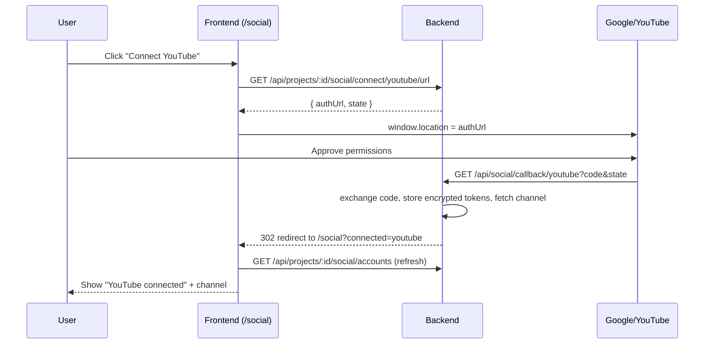

# Frontend Guide — Connecting Social Accounts (YouTube OAuth)

> Audience: frontend team
> Pairs with: `backend-social-accounts.md` (backend contract), `frontend-integration.md` (projects/auth)
> Affected files: `src/pages/SocialAccountsPage.jsx`, `src/utils/projects.js`, `src/utils/api.js`
> Base URL: `VITE_API_URL` (default `http://localhost:8000`)

## 1. How the connect flow works

Connecting is a **redirect-based OAuth handshake** — you can't just POST a boolean, the user
has to approve on Google. The backend does all the token work; the frontend only (1) asks for
an authorize URL, (2) sends the browser there, and (3) refreshes the list when the user returns.



Key points:
- **You do NOT handle the `code` or tokens.** The provider redirects to the **backend**
  callback, not the frontend. The backend finishes the flow and redirects back to your
  `/social` page with a flag.
- **You do NOT need to store `state`.** The backend signs and verifies it itself (CSRF). The
  `state` value in the response is informational.
- The connection is **per active project**. Always use the current `activeProjectId`.

## 2. Endpoints used

| Action | Request |
| ------ | ------- |
| Get authorize URL | `GET /api/projects/:projectId/social/connect/:platform/url` → `{ authUrl, state }` |
| List accounts | `GET /api/projects/:projectId/social/accounts` → `SocialAccount[]` |
| Disconnect | `DELETE /api/projects/:projectId/social/disconnect/:platform` |

Responses for the authorize URL call:
- `200` → `{ "authUrl": "...", "state": "..." }`
- `400` → unknown platform
- `501` → `{ "message": "tiktok connection is not available yet.", "platform": "tiktok" }`
  (use this to disable not-yet-supported buttons)
- `404` → project not yours / doesn't exist

A `SocialAccount` object (public shape — never includes tokens):

```json
{
  "id": "…",
  "projectId": "5f1c0c2e-…",
  "platform": "youtube",
  "handle": "@cara",
  "displayName": "Cara's Channel",
  "connected": true,
  "avatarUrl": "https://…",
  "tokenExpiresAt": "2026-06-27T13:00:00Z",
  "createdAt": "2026-06-27T12:00:00Z"
}
```

## 3. API helpers (`src/utils/projects.js`)

```js
import { api } from "./api"; // your axios/fetch wrapper that attaches the Bearer token

// 1) Ask the backend for the Google authorize URL, then send the browser there.
export async function connectPlatform(projectId, platform) {
  const { data } = await api.get(
    `/api/projects/${projectId}/social/connect/${platform}/url`
  );
  // Full-page redirect — the backend callback will bring the user back to /social.
  window.location.href = data.authUrl;
}

// 2) List connected accounts for a project.
export async function listSocialAccounts(projectId) {
  const { data } = await api.get(`/api/projects/${projectId}/social/accounts`);
  return data; // SocialAccount[]
}

// 3) Disconnect a platform.
export async function disconnectPlatform(projectId, platform) {
  await api.delete(`/api/projects/${projectId}/social/disconnect/${platform}`);
}
```

> If you use raw `fetch`, remember to add `Authorization: Bearer ${accessToken}` and
> `Content-Type: application/json`. The connect/list/disconnect calls are all authenticated.
> The provider callback is **not** called by you — ignore it on the frontend.

## 4. The `/social` page — handle the return redirect

When the backend finishes, the browser lands on `/social?connected=youtube` (or
`?error=youtube`). Read the query param, show a toast, refetch, and clean the URL.

```jsx
import { useEffect, useState, useCallback } from "react";
import { useSearchParams } from "react-router-dom";
import { connectPlatform, listSocialAccounts, disconnectPlatform } from "../utils/projects";
import { useActiveProject } from "../hooks/useActiveProject"; // however you expose it

const PLATFORMS = [
  { key: "youtube", label: "YouTube", available: true },
  { key: "tiktok", label: "TikTok", available: false },
  { key: "instagram", label: "Instagram", available: false },
  { key: "facebook", label: "Facebook", available: false },
];

export default function SocialAccountsPage() {
  const { activeProjectId } = useActiveProject();
  const [accounts, setAccounts] = useState([]);
  const [searchParams, setSearchParams] = useSearchParams();

  const refresh = useCallback(async () => {
    if (!activeProjectId) return;
    setAccounts(await listSocialAccounts(activeProjectId));
  }, [activeProjectId]);

  // On return from Google, show a toast and refresh the list.
  useEffect(() => {
    const connected = searchParams.get("connected");
    const error = searchParams.get("error");
    if (connected) toast.success(`${connected} connected`);
    if (error) toast.error(`Couldn't connect ${error}. Please try again.`);
    if (connected || error) {
      refresh();
      setSearchParams({}, { replace: true }); // strip the query flag
    }
  }, [searchParams, refresh, setSearchParams]);

  useEffect(() => { refresh(); }, [refresh]);

  const byPlatform = Object.fromEntries(accounts.map((a) => [a.platform, a]));

  return (
    <div>
      {PLATFORMS.map(({ key, label, available }) => {
        const acct = byPlatform[key];
        const isConnected = acct?.connected;
        return (
          <div key={key} className="social-row">
            <span>{label}</span>
            {isConnected ? (
              <>
                <span>{acct.displayName || acct.handle}</span>
                <button onClick={() => disconnectPlatform(activeProjectId, key).then(refresh)}>
                  Disconnect
                </button>
              </>
            ) : (
              <button
                disabled={!available}
                title={available ? "" : "Coming soon"}
                onClick={() => connectPlatform(activeProjectId, key)}
              >
                {available ? "Connect" : "Coming soon"}
              </button>
            )}
          </div>
        );
      })}
    </div>
  );
}
```

## 5. Handling "not available yet" platforms

Until TikTok/Instagram/Facebook are implemented, their connect-url call returns **`501`**. Two
options (the example above uses option A):

- **A. Static flag (simplest):** mark `available: false` in your platform list and disable the
  button. Update when the backend ships each platform.
- **B. React to `501`:** attempt the call and, on a `501` response, disable the button and show
  the `message` from the body. More dynamic, no frontend change when a platform ships.

## 6. Gotchas / expectations

- **Use a full-page redirect** (`window.location.href = authUrl`), not `fetch`. Google's
  consent screen cannot be loaded via AJAX/iframe.
- **Test users only:** while the Google app is in "Testing", only accounts added as test users
  in GCP can complete the flow; others see "Access blocked".
- **Uploaded videos will be private** until the YouTube API audit passes — this is a backend/Google
  constraint, not a frontend issue. Don't surface it as an error.
- **Active project required:** if `activeProjectId` is null (user has no project), route them to
  onboarding first — there's nothing to attach the connection to.
- **No popup needed:** the redirect round-trip returns the user straight to `/social`. If you
  prefer a popup, open `authUrl` in a popup and poll/`postMessage` on return — but the simple
  redirect is recommended.
